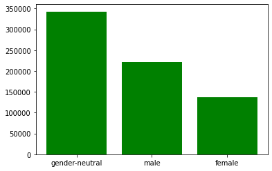
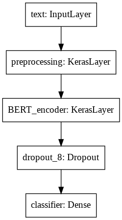
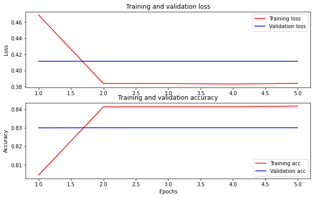
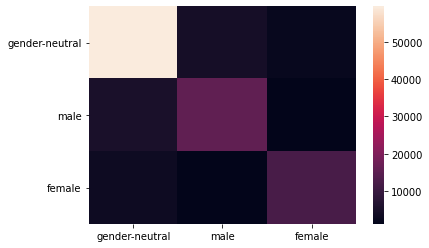

# Gender-Bias-BERT
A BERT based model to analyze and determine the Genderness of the topic in a text in TF2.0, For scientific purposes, Gender here refers to biological sex and that only.

[Dataset and the Model](https://drive.google.com/drive/folders/1on2PAbMhS8E3EKGMhxyWUUj3s1YFRNj7?usp=sharing)  - Cleaned data - MDGender - "About" inferences 

[Notebook file](https://github.com/baasitsharief/Gender-Bias-BERT/blob/main/Gender_Analysis_Text_TF.ipynb)

## Dataset Analysis

### Counts -


## Model Analysis

### Model Architecture



### Model hyperparameters

```
epochs = 5
steps_per_epoch = train_size//batch_size
num_train_steps = steps_per_epoch * epochs
num_warmup_steps = int(0.1*num_train_steps)

init_lr = 3e-5
optimizer = optimization.create_optimizer(init_lr=init_lr,
                                          num_train_steps=num_train_steps,
                                          num_warmup_steps=num_warmup_steps,
                                          optimizer_type='adamw')
```

### Loss and Accuracy Curves


### Classification Report

```
              precision    recall  f1-score   support

           0       0.88      0.90      0.89     66424
           1       0.74      0.71      0.72     22211
           2       0.76      0.74      0.75     16788

    accuracy                           0.83    105423
   macro avg       0.79      0.78      0.79    105423
weighted avg       0.83      0.83      0.83    105423
```

### Confusion Matrix


